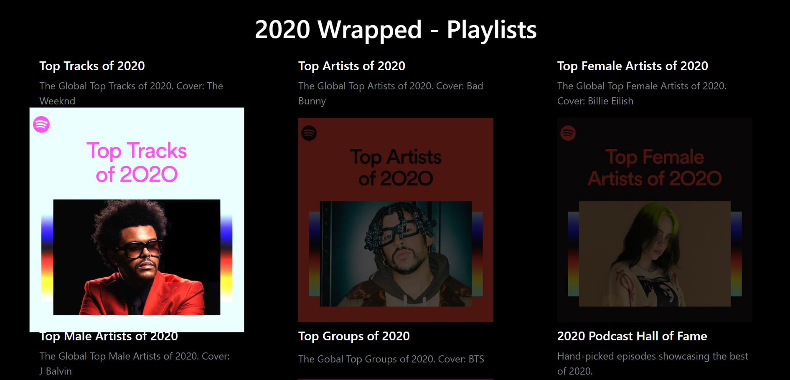

# Spotify API

Browse Spotify playlists and receive an email with popular tracks

# Functionalities

- [x] It allows users to browse Spotify genres, playlists, and tracks
- [x] If interested, users can request an email of the tracks with high popularity rating (above 95) from the selected playlist

# Technologies Used

This project was built using HTML, CSS, JavaScript, jQuery, Bootstrap, and third-party APIs.  
APIs used: Spotify Web API, Mailchimp Transactional API

# Screenshots

